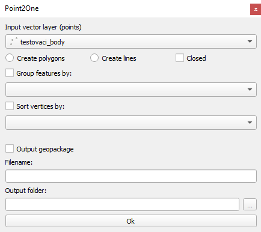
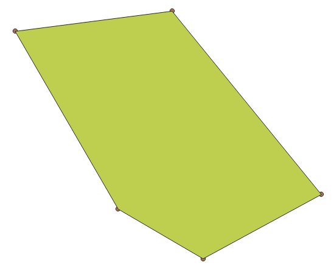
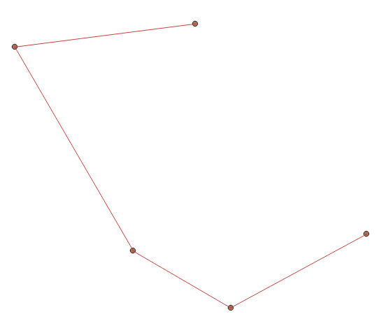
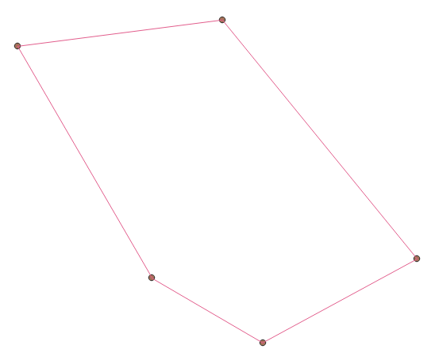
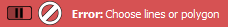
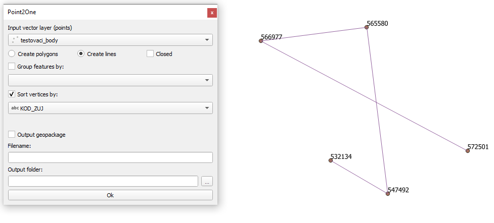
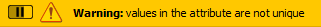
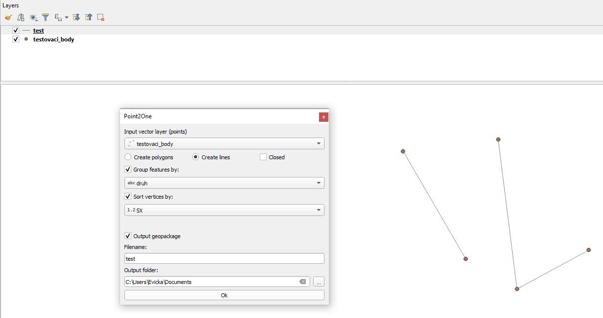
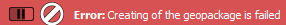
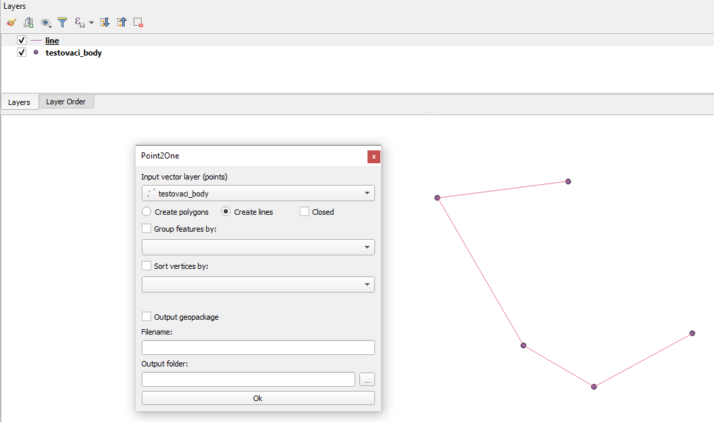

Tutorial
============================================
You can watch `Video tutorial
<https://www.youtube.com/watch?v=BFo1Y43wTKQ&fbclid=IwAR10lgU6CXsMvig2GXFhH0-hXp2Hi8XPJS3spA0OUF8Gj0NoI43iZdy8a-s>`__
or you can read it:

In the Input vector layer section there is a combo box where you can choose which point layer you want to use.  

Under the combo box there are 3 checkboxes:

* **Create polygon** - create a polygon layer 

* **Create lines** - create a linestring layer

* **Closed** - the last point be connected to first one, completing the circuit

You can chosse some parameters to connect the points. By default, the points are connected in the order they are in the selected point layer.

If you don't check Create polygon or Create lines it displays error message.

If you check 

* **Sort vertices by** - select an attribute, the order of connecting points will change from the lowest to the highest number in selected attribute or alphabetically from A-Z if the attribute is a string

If you choose an attribute which does not contain unique values. It displays warning message. 

* **Group features by** - it divide the selected point layer into groups that have the same value in the attribute selected in the combo box

.. image:: images/group.png

If you check **output geopackage**

The plugin is saving output geopackage, where you type in the name of the newly created layer and path to where it should be saved. By pressing **OK** it will create a geopackage that includes all informations about the newly created layer.

There is a limitation to that: if you already have a geopackage with that name saved and you want to create a different layer with the same name, the new layer will not be created and it will display error message , so there are 2 choices, either you change the filename or you will have to delete the geopackage with the name you want to use first. 

If you don't check **output geopackage**

The new layer will still be created, but saved only as an in-memory layer therefore you will lose the data after you close the project.

If you want to run the plugin you have to press **OK** always.

Sometimes it may take a while. Please, don't close QGIS and wait. It depends on the amount of points.

